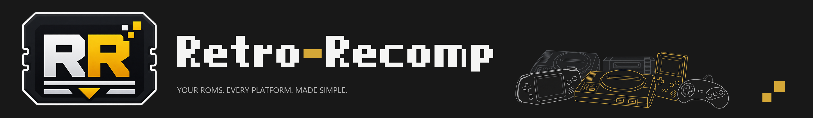
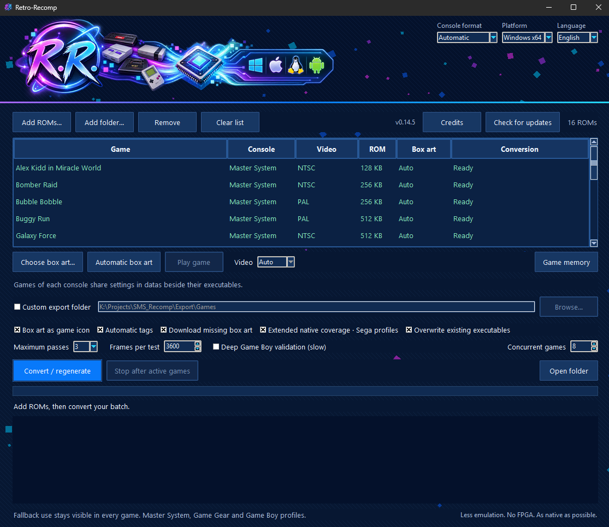
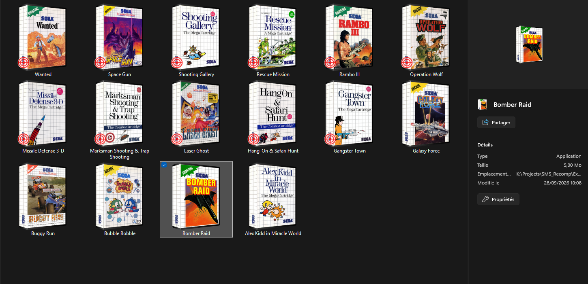

<p align="center">
  
</p>

<h1 align="center">RetroRecomp</h1>
<p align="center"><strong>Your Master System games, ready to launch.</strong></p>
<p align="center">Add a ROM or a whole folder, convert, and play standalone Windows games.<br>
More work happens before launch, so playing stays simple and responsive.</p>
<p align="center"><em>Less emulation. No FPGA. As native as possible.</em></p>

<p align="center">
  
  
  
  
</p>

<p align="center">
  <a href="https://github.com/ArthurReboulSalze/RetroRecomp/releases">Releases</a> ·
  <a href="docs/BUILDING.md">Build from source</a> ·
  <a href="docs/ROADMAP.md">Roadmap</a> ·
  <a href="THIRD_PARTY_NOTICES.md">Credits and licensing</a>
</p>

## Why RetroRecomp?

- **Simple from conversion to play.** Choose one ROM or batch a folder, then
  launch each game from its own executable. Playing needs no Python, separate
  ROM file or external SDL2 DLL. Regenerating a game replaces its previous
  export instead of filling the folder with numbered builds.
- **Native-first performance.** RetroRecomp translates the game's Z80 program
  ahead of time and prepares extended ROM-bank coverage by default. Covered
  CPU paths run as compiled host code; any use of the reference interpreter
  is counted and reported. This reduces interpretation work during play and
  is designed to feel responsive even on a modest PC.
- **A practical Master System experience.** The Master System backend is now
  viable for everyday play with supported Sega-mapper ROMs. It includes two
  players, gamepad mapping, fullscreen and lightweight display filters,
  PAL/NTSC timing choices, quick states and mouse Light Phaser support for
  known gun games. Recent exports have also been reviewed in gameplay, while
  full-catalogue compatibility and exact hardware behavior remain open work.

<p align="center">
  
</p>
<p align="center"><em>Choose your ROMs, convert a batch, and launch the finished games.</em></p>

## How it works

RetroRecomp converts the Z80 program inside a Sega Master System ROM into C,
then compiles it into a Windows executable. The resulting game contains its
own ROM data and runtime, so playing it does not require Python, a separate
ROM file, or an external SDL2 DLL.

Video, sound, memory, inputs, bank switching and interrupts are still
reproduced by a hardware runtime. **This is static CPU recompilation with a
hardware runtime and a reported fallback interpreter.** Native coverage,
CPU agreement, hardware fidelity, gameplay and physical latency are separate
questions; none is proved by the others.

### Compile more. Discover less at runtime.

Extended native coverage is enabled by default. It prepares supported
instruction positions across ROM banks before play, so indirect jumps and
bank changes can reach precompiled code. Unknown or changed RAM code can
still require the reference interpreter; its use is counted and reported.

### Each generation can improve the next

Discoveries made during the converter's automated tests are saved locally
against the game's identity. A later
conversion verifies those observations against the ROM, compiles additional
RAM instruction variants with byte guards, and checks the candidate build
before replacing the previous executable. An unknown variant remains a
reported fallback rather than being treated as known code.

This memory is a compilation library, not an AI model. An optional local AI
player to explore more paths is a future research direction; it is not part
of the current release. See [the architecture](docs/ARCHITECTURE.md).

## Available today

| Capability | Current release |
| --- | --- |
| Game system | Sega Master System, Sega mapper |
| Output | Standalone Windows x64 game executable |
| Conversion | Single ROM or batch; extended coverage enabled by default |
| Improvement | Verified observations and guarded RAM variants reused on regeneration |
| Interface | English and French, with contextual help and conversion log |
| Inputs | Two players, separate keyboard mappings, Xbox/XInput-style gamepads |
| Presentation | Integer-scaled fullscreen, sharp pixels, bilinear, Scale2x, scanlines |
| Video timing | Per-ROM PAL/NTSC selection; the saved choice survives compiler updates |
| Light Phaser | Mouse aiming in catalogue-selected gun games; configurable reticle |
| Quick states | F8 save and F9 load, including after restarting the game |
| Game icons | Optional local/online box art and automatic shooting badges |
| Files | Shared `datas` folder; game-specific data isolated by identity |
| Regeneration | Same game filename; replacement deferred if the executable is running |

<p align="center">
  
</p>
<p align="center"><em>Your generated games remain easy to recognize in Windows Explorer.</em></p>

Version 0.10.17 adds scanline-aware video, PAL/NTSC timing choices, strict
CPU/VDP comparisons and persistent quick states. Its Light Phaser mode uses
mouse aiming for known gun games; the reticle and automatic icon badges are
configurable. See [video timing](docs/VIDEO.md),
[Light Phaser support](docs/LIGHT_PHASER.md),
[game states](docs/GAME_STATES.md) and
[console profiles](docs/SYSTEM_PROFILES.md) for the details and limits.

Generated games create no `datas` folder, default INI or diagnostic log just
from being launched. Settings and quick states are saved only when requested;
the converter keeps its separate learning library for future generations.
The screenshots above show locally generated icons; the repository and ZIP
contain **no ROMs, game executables, separate box-art files, gameplay captures
or personal compilation libraries**.
Use your own ROMs and artwork that you are entitled to use. Generated game
executables embed the ROM and must not be treated as redistributable merely
because RetroRecomp generated them.

## Getting started on Windows

1. Download and extract the Windows x64 ZIP from [Releases](https://github.com/ArthurReboulSalze/RetroRecomp/releases).
2. Install Git and Visual Studio Build Tools with **Desktop development with C++**, including x64 tools, CMake and a Windows SDK. Python is unnecessary for the packaged converter.
3. Run `Retro-Recomp.exe`, choose **Add ROMs** or **Add folder**, then **Convert / regenerate**.
4. Select a successful result and choose **Play game**.

The first conversion downloads pinned build dependencies and compiles them.
Internet access is required for that setup. Afterward, cached dependencies can
be reused; missing-cover downloads are optional. No ROM is uploaded by the
cover lookup: it uses the game title.

```text
RetroRecomp/
  Retro-Recomp.exe
  LICENSE
  THIRD_PARTY_NOTICES.md
  licenses/
  datas/                         created locally when needed
  Games/
    Master System/
      Your game.exe              created from your own ROM
      datas/                     saved controls/states; conversion reports when generated
```

The release starts clean: it contains no saved settings, games or learned
observations. Files are resolved relative to the application and games,
including when launched from a different working directory.

### Game shortcuts

| Key | Action |
| --- | --- |
| F1 | Restart |
| F2 | Configure keyboard/gamepad mappings, including Start/Menu and J1 Select/Reset |
| F3 | Next filter |
| F4 | Window → pixel-perfect fullscreen → fit fullscreen → window |
| F6 | Gamepad autofire on/off |
| F7 | English/French |
| F8 | Save/replace this game's quick state |
| F9 | Load it, including after quitting and restarting |
| H | Help |
| P / Enter | Pause/resume; Enter retains its binding role inside F2 |
| Esc | Close the current menu, then quit |

Gamepad Start/Menu pauses by default. Select/Back restarts for player 1 only;
player 2 cannot reset. Fullscreen keeps interpreter diagnostics out of the
game image, while counters remain available and logs require explicit
diagnostics. Games exported before quick states were added need regeneration
to gain F8/F9. See [controls](docs/CONTROLS.md)
and [state storage and compatibility](docs/GAME_STATES.md).

## What has been verified

The measurements are deliberately separate:

| Area | Evidence and limit |
| --- | --- |
| Native execution | Several local games reached zero fallback cycles in their tested demo and scripted-play scenarios. This does not cover every game path. |
| CPU fidelity | Independent Z80 checks covered 51,328 cases for the native CPU work; current conversions also compare observed CPU results with the reference interpreter. |
| Reference comparison | Conversion checks compare CPU, RAM, image hashes and VDP traces on observed scenarios. Both paths share the same hardware runtime. |
| Hardware fidelity | Authored NTSC/PAL and scanline checks pass; complete console fidelity, including pixel-clock effects, is not established. |
| Gameplay | Recent exports have been reviewed in play, but full-catalogue playthroughs and physical two-controller sessions are not established. |
| Physical latency | Not measured; no zero-latency guarantee. |

Version 0.10.17 passes 66 Python tests and authored native checks for video,
input and state handling. Validation files and game captures stay local; they
are not bundled with this public repository.

See [compatibility and limitations](docs/COMPATIBILITY.md) before assuming
a game, mapper or platform is supported.

## Next for Master System

Work continues on game coverage, hardware behavior and validation of more
gameplay paths. The [roadmap](docs/ROADMAP.md) tracks these Master System
priorities without promising compatibility for every cartridge.

## Development and credits

The desktop application is written in Python; the generated games and host
runtime use C and SDL2. [Build instructions](docs/BUILDING.md) cover source
usage, packaging and reproducible dependency revisions.

RetroRecomp builds on [mstan/smsggrecomp](https://github.com/mstan/smsggrecomp),
[mstan/z80-recomp-core](https://github.com/mstan/z80-recomp-core),
[superzazu/z80](https://github.com/superzazu/z80),
[SDL2](https://github.com/libsdl-org/SDL),
[Pillow](https://python-pillow.org/), and
[SingleStepTests/z80](https://github.com/SingleStepTests/z80) for independent CPU validation.

**Original RetroRecomp contributions are licensed under [MIT](LICENSE).**
Third-party material retains its own terms. The pinned upstream engine states
that its license is not yet declared; the shared Z80 core uses PolyForm
Noncommercial 1.0.0. MIT does not override those terms or grant rights to ROMs
or artwork. See [third-party notices and the outstanding licensing issue](THIRD_PARTY_NOTICES.md).

Contributions are welcome. Read [CONTRIBUTING.md](CONTRIBUTING.md), and do not
attach commercial ROMs, generated game binaries, copyrighted box art or private logs.
